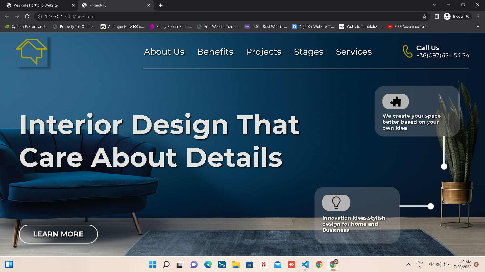

# **Project-10 Interior Design Landing Page Responsive**

## _Name: Aditya Bankar_

> This is the landing Page in which i learn about how to write HTML from scrath. How to structure the HTML. 
Structuring HTML and play with Css using Positioning, Flexbox and media queries

>Media Queries breakpoints used in this website

### Media Query breakpoint 
1. max-width: 799px
2. min-width: 800px
3. max-width: 1350px and min-width: 800px

## Time Taken
4 hrs was the time required.

